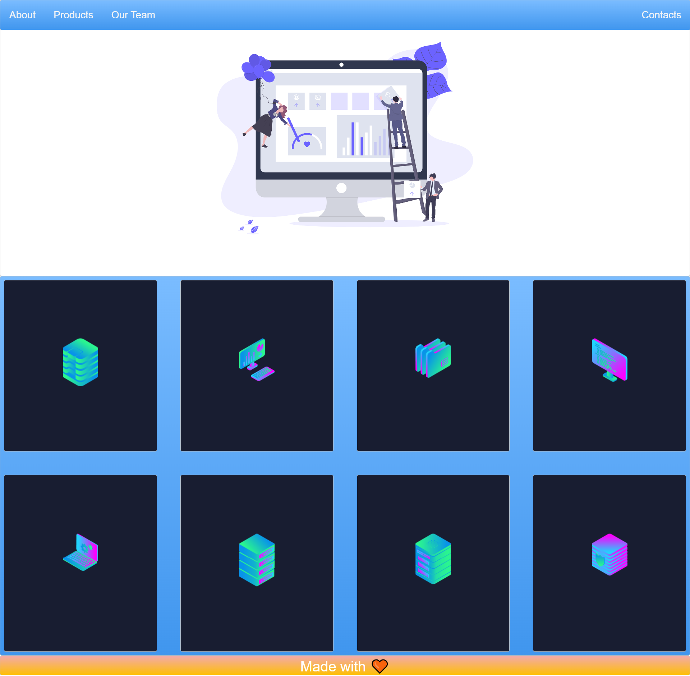

# Sample Responsive Website

This project is a responsive website built using HTML and CSS, utilizing exclusive features such as Flexbox and Grid for optimal layout and design. The website is designed to adapt and display properly on various devices and screen sizes.

## Features

This website includes the following features:

* Easy-to-read typography.
* Cross-browser compatibility.
* Interactive and engaging design.
* Smooth animations and transitions.
* Mobile-first approach for optimal mobile viewing experience.
* Responsive layout using one-dimensional Flexbox and two-dimensional Grid.

## Technologies Used

The website was built using the following technologies:

* HTML
* CSS (including Flexbox and Grid)

## 🛠 Installation and Setup Instructions

1. git clone https://github.com/tawfik575/sample-responsive-website-1.git
2. cd sample-responsive-website-1
3. start index.html

## Contributing

This is a sample project and contributions are not necessary. However, if you would like to contribute to the project, please fork the repository and submit a pull request.

## License

This project is licensed under the MIT License. See the LICENSE file for more information.

## Contact

If you have any questions or comments about the project, please contact the project owner by sending an email at `tawfikbsmrstucse@gmail.com`.